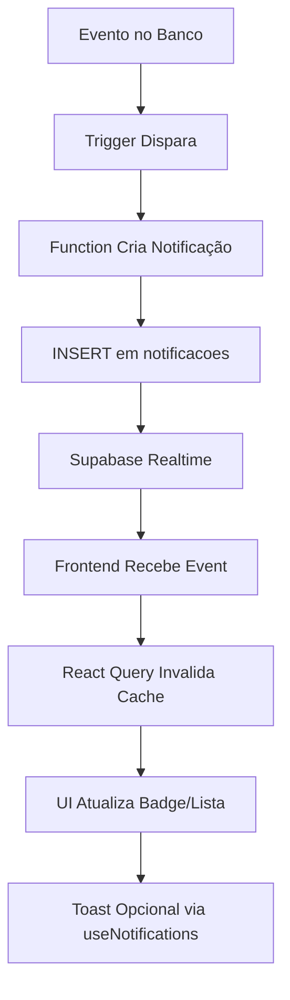

# 🔔 Sistema de Notificações - Verana

## 📋 Visão Geral

O sistema de notificações do Verana utiliza **triggers PostgreSQL** para criar notificações automaticamente em eventos importantes, e **Supabase Realtime** para atualizar a interface em tempo real sem necessidade de refresh.

## 🎯 Tipos de Notificação

### 1️⃣ **Notificações de Agendamentos**
- `agendamento_novo` - Novo agendamento criado
- `agendamento_cancelado` - Agendamento cancelado
- `checkin_realizado` - Check-in realizado com sucesso

### 2️⃣ **Notificações Financeiras (FASE 3 ✅)**
- `fatura_gerada` - Nova fatura mensal criada
- `lembrete_pagamento` - Lembrete de vencimento (3 dias antes)
- `pagamento_vencido` - Fatura vencida
- `pagamento_recebido` - Pagamento confirmado

### 3️⃣ **Notificações de Assinatura (FASE 3 ✅)**
- `assinatura_criada` - Assinatura ativada com sucesso
- `assinatura_cancelada` - Assinatura cancelada
- `arena_suspensa` - Arena suspensa por inadimplência

### 4️⃣ **Notificações de Aulas e Professor**
- `aula_confirmada` - Aula confirmada
- `novo_aluno` - Novo aluno vinculado ao professor
- `professor_vinculado` - Professor atribuído ao aluno

### 5️⃣ **Notificações de Sistema**
- `sistema_alerta` - Alertas gerais do sistema
- `financeiro_alerta` - Alertas financeiros

## 🔄 Triggers Implementados (FASE 3)

### ✅ `notificar_arena_nova_fatura`
**Disparo:** Após `INSERT` em `faturas_sistema`  
**Destinatários:** Arena Admins  
**Conteúdo:**
- Número da fatura
- Valor formatado (R$ X.XXX,XX)
- Competência (MM/YYYY)
- Data de vencimento
- Link para `/configuracoes-arena`

**Exemplo:**
```
Título: 💰 Nova Fatura Gerada
Mensagem: Fatura FAT-202501-000001 criada no valor de R$ 199,90 
(competência 01/2025). Vencimento: 05/02/2025.
```

### ✅ `notificar_arena_nova_assinatura`
**Disparo:** Após `INSERT` em `assinaturas_arena` (quando `status = 'ativo'`)  
**Destinatários:** Arena Admins  
**Conteúdo:**
- Número da assinatura
- Nome do plano
- Valor mensal
- Dia de vencimento
- Link para `/configuracoes-arena`

**Exemplo:**
```
Título: 🎉 Assinatura Ativada
Mensagem: Assinatura ASS-20250120-000001 ativada com sucesso! 
Plano: Plano Premium. Valor mensal: R$ 199,90. 
Vencimento dia 5 de cada mês.
```

### ✅ `notificar_arena_suspensao`
**Disparo:** Após `UPDATE` de `status` em `arenas` (mudança para `suspenso`)  
**Destinatários:** 
- Arena Admins (motivo detalhado)
- Todos os usuários da arena (mensagem informativa)

**Conteúdo para Admins:**
```
Título: 🚫 Arena Suspensa
Mensagem: Sua arena foi suspensa por inadimplência de fatura. 
O acesso ao sistema está bloqueado até a regularização. 
Entre em contato com o suporte ou regularize os pagamentos pendentes.
```

**Conteúdo para Usuários:**
```
Título: ⚠️ Arena Temporariamente Indisponível
Mensagem: O acesso à arena está temporariamente suspenso. 
Entre em contato com o administrador da arena para mais informações.
```

### ✅ `notificar_assinatura_cancelada`
**Disparo:** Após `UPDATE` de `status` em `assinaturas_arena` (mudança para `cancelado`)  
**Destinatários:** Arena Admins  
**Conteúdo:**
```
Título: ❌ Assinatura Cancelada
Mensagem: A assinatura ASS-20250120-000001 foi cancelada. 
O acesso aos módulos será mantido até 31/01/2025. 
Entre em contato com o suporte para reativar ou alterar o plano.
```

## 🚀 Realtime Updates

### Configuração
```sql
-- Habilitar REPLICA IDENTITY FULL (captura todos os dados da linha)
ALTER TABLE notificacoes REPLICA IDENTITY FULL;

-- Adicionar tabela à publicação realtime
ALTER PUBLICATION supabase_realtime ADD TABLE notificacoes;
```

### Frontend (NotificationBell.tsx)
```typescript
useEffect(() => {
  if (!usuario?.id) return;

  const channel = supabase
    .channel(`notificacoes-realtime-${usuario.id}`)
    .on(
      "postgres_changes",
      {
        event: "INSERT", // Nova notificação
        schema: "public",
        table: "notificacoes",
        filter: `usuario_id=eq.${usuario.id}`,
      },
      () => {
        queryClient.invalidateQueries({ queryKey: ["notificacoes"] });
      }
    )
    .on(
      "postgres_changes",
      {
        event: "UPDATE", // Notificação marcada como lida
        schema: "public",
        table: "notificacoes",
        filter: `usuario_id=eq.${usuario.id}`,
      },
      () => {
        queryClient.invalidateQueries({ queryKey: ["notificacoes"] });
      }
    )
    .subscribe();

  return () => {
    supabase.removeChannel(channel);
  };
}, [usuario?.id, queryClient]);
```

## 📊 Fluxo de Notificação



## 🎨 UI Components

### NotificationBell (Badge Contador)
- Mostra número de notificações não lidas
- Badge vermelho com counter (máx 9+)
- Dropdown com lista de notificações
- Scroll area para até 20 notificações
- Ícone personalizado por tipo
- Indicador visual para não lidas
- Botão "Marcar todas como lidas"

### useNotifications Hook (Toast)
- Exibe toast automático para novas notificações
- Botão "Ver" que navega para o link
- Duração de 5 segundos
- Usado em `App.tsx` para capturar em tempo real

## 🔍 Queries e Mutations

### Query: Buscar Notificações
```typescript
const { data: notificacoes } = useQuery({
  queryKey: ["notificacoes", usuario?.id],
  queryFn: async () => {
    const { data } = await supabase
      .from("notificacoes")
      .select("*")
      .eq("usuario_id", usuario.id)
      .order("created_at", { ascending: false })
      .limit(20);
    return data;
  },
  enabled: !!usuario?.id,
  refetchOnWindowFocus: true,
});
```

### Mutation: Marcar Como Lida
```typescript
const marcarLidaMutation = useMutation({
  mutationFn: async (notificacaoId: string) => {
    await supabase
      .from("notificacoes")
      .update({ lida: true, lida_em: new Date().toISOString() })
      .eq("id", notificacaoId);
  },
  onSuccess: () => {
    queryClient.invalidateQueries({ queryKey: ["notificacoes"] });
  },
});
```

## 🔒 RLS (Row Level Security)

### Políticas Implementadas
```sql
-- Usuários veem apenas suas notificações
CREATE POLICY "Usuários veem suas notificações"
ON notificacoes FOR SELECT
TO authenticated
USING (usuario_id IN (
  SELECT id FROM usuarios WHERE auth_id = auth.uid()
));

-- Usuários atualizam apenas suas notificações (marcar como lida)
CREATE POLICY "Usuários podem atualizar suas notificações"
ON notificacoes FOR UPDATE
TO authenticated
USING (usuario_id IN (
  SELECT id FROM usuarios WHERE auth_id = auth.uid()
));

-- Sistema pode criar notificações (triggers)
CREATE POLICY "Sistema pode criar notificações"
ON notificacoes FOR INSERT
TO authenticated
WITH CHECK (true);
```

## 📝 Metadados por Tipo

### `fatura_gerada`
```json
{
  "fatura_id": "uuid",
  "numero_fatura": "FAT-202501-000001",
  "valor": 199.90,
  "data_vencimento": "2025-02-05",
  "competencia": "2025-01-01"
}
```

### `assinatura_criada`
```json
{
  "assinatura_id": "uuid",
  "numero_assinatura": "ASS-20250120-000001",
  "plano_nome": "Plano Premium",
  "valor_mensal": 199.90,
  "dia_vencimento": 5,
  "data_inicio": "2025-01-20"
}
```

### `arena_suspensa`
```json
{
  "arena_id": "uuid",
  "arena_nome": "Arena Champions",
  "status_anterior": "ativo",
  "motivo": "inadimplência de fatura",
  "data_suspensao": "2025-01-20T10:30:00Z"
}
```

## 🧪 Testando Notificações

### 1. Criar Fatura Manualmente
```sql
INSERT INTO faturas_sistema (
  assinatura_arena_id,
  arena_id,
  competencia,
  data_vencimento,
  valor,
  status_pagamento
) VALUES (
  'uuid-assinatura',
  'uuid-arena',
  '2025-01-01',
  '2025-02-05',
  199.90,
  'pendente'
);
-- ✅ Notificação criada automaticamente
```

### 2. Criar Assinatura
```sql
INSERT INTO assinaturas_arena (
  arena_id,
  plano_sistema_id,
  valor_mensal,
  data_inicio,
  dia_vencimento,
  status
) VALUES (
  'uuid-arena',
  'uuid-plano',
  199.90,
  CURRENT_DATE,
  5,
  'ativo'
);
-- ✅ Notificação criada automaticamente
```

### 3. Suspender Arena
```sql
UPDATE arenas
SET status = 'suspenso'
WHERE id = 'uuid-arena';
-- ✅ Notificações criadas para admins e usuários
```

## 📈 Monitoramento

### Ver Últimas Notificações Criadas
```sql
SELECT 
  n.created_at,
  n.tipo,
  n.titulo,
  u.nome_completo as destinatario,
  a.nome as arena,
  n.lida
FROM notificacoes n
JOIN usuarios u ON u.id = n.usuario_id
LEFT JOIN arenas a ON a.id = n.arena_id
ORDER BY n.created_at DESC
LIMIT 20;
```

### Estatísticas de Notificações
```sql
SELECT 
  tipo,
  COUNT(*) as total,
  COUNT(*) FILTER (WHERE lida) as lidas,
  COUNT(*) FILTER (WHERE NOT lida) as nao_lidas
FROM notificacoes
WHERE created_at > CURRENT_DATE - INTERVAL '7 days'
GROUP BY tipo
ORDER BY total DESC;
```

## 🔗 Integração com WhatsApp (Futuro)

Para integrar notificações com WhatsApp via Evolution API:

```typescript
// Em cada trigger, após criar notificação:
const { data: config } = await supabase
  .from('configuracoes_arena')
  .select('notificacoes_whatsapp_enabled, evolution_api_enabled')
  .eq('arena_id', arena_id)
  .single();

if (config?.notificacoes_whatsapp_enabled && config?.evolution_api_enabled) {
  // Invocar edge function enviar-whatsapp-evolution
  await supabase.functions.invoke('enviar-whatsapp-evolution', {
    body: {
      arena_id: arena_id,
      usuario_id: usuario_id,
      mensagem: notificacao.mensagem
    }
  });
}
```

## ✅ Checklist de Implementação

- [x] Trigger `notificar_arena_nova_fatura`
- [x] Trigger `notificar_arena_nova_assinatura`
- [x] Trigger `notificar_arena_suspensao`
- [x] Trigger `notificar_assinatura_cancelada`
- [x] Realtime para INSERT de notificações
- [x] Realtime para UPDATE de notificações
- [x] NotificationBell com novos tipos
- [x] Ícones personalizados por tipo
- [x] Documentação completa
- [ ] Integração com WhatsApp (Futuro)
- [ ] Email notifications (Futuro)
- [ ] Push notifications (Futuro)
